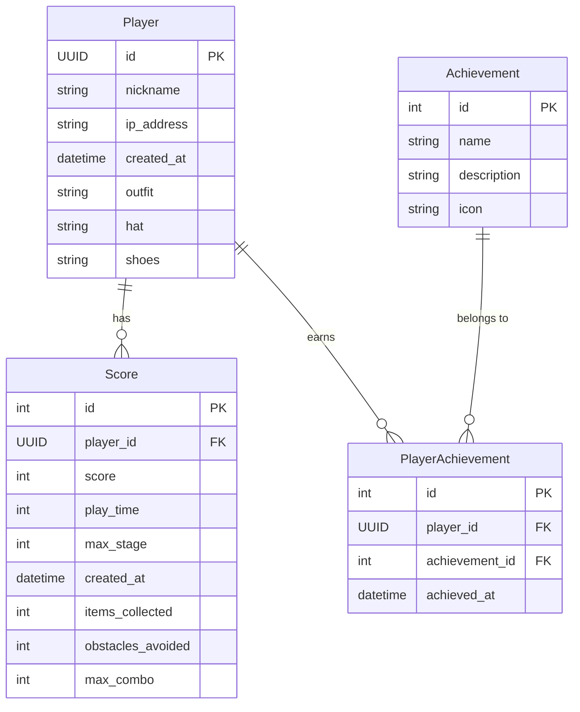

# Boo 게임 ERD (Entity Relationship Diagram)

## 개체 관계도

## 모델 설명

### Player (플레이어)
- 게임을 플레이하는 사용자 정보를 저장
- UUID를 통해 고유 식별
- 커스터마이징 정보(의상, 모자, 신발) 보유

### Score (점수)
- 각 게임 플레이 결과를 저장
- 점수, 플레이 시간, 도달한 스테이지 등 기록
- 아이템 수집, 장애물 회피, 최대 콤보 등 게임 통계 포함
- 플레이어와 다대일(N:1) 관계

### Achievement (업적)
- 게임 내 달성 가능한 업적 정의
- 업적 이름, 설명 및 아이콘 정보 포함

### PlayerAchievement (플레이어 업적)
- 특정 플레이어가 달성한 업적 기록
- 플레이어와 업적 간 다대다(M:N) 관계를 구현하는 연결 테이블
- 업적 달성 시간 기록

## 관계 설명

1. **Player - Score (1:N)**
   - 한 플레이어는 여러 번 게임을 플레이하여 다수의 점수 기록을 가질 수 있음
   - 각 점수 기록은 오직 한 플레이어에게만 속함

2. **Player - PlayerAchievement - Achievement (M:N)**
   - 한 플레이어는 여러 업적을 달성할 수 있음
   - 하나의 업적은 여러 플레이어에 의해 달성될 수 있음
   - PlayerAchievement 테이블을 통해 이 다대다 관계 구현
   - 플레이어와 업적 조합은 유일함(unique_together 제약조건) 