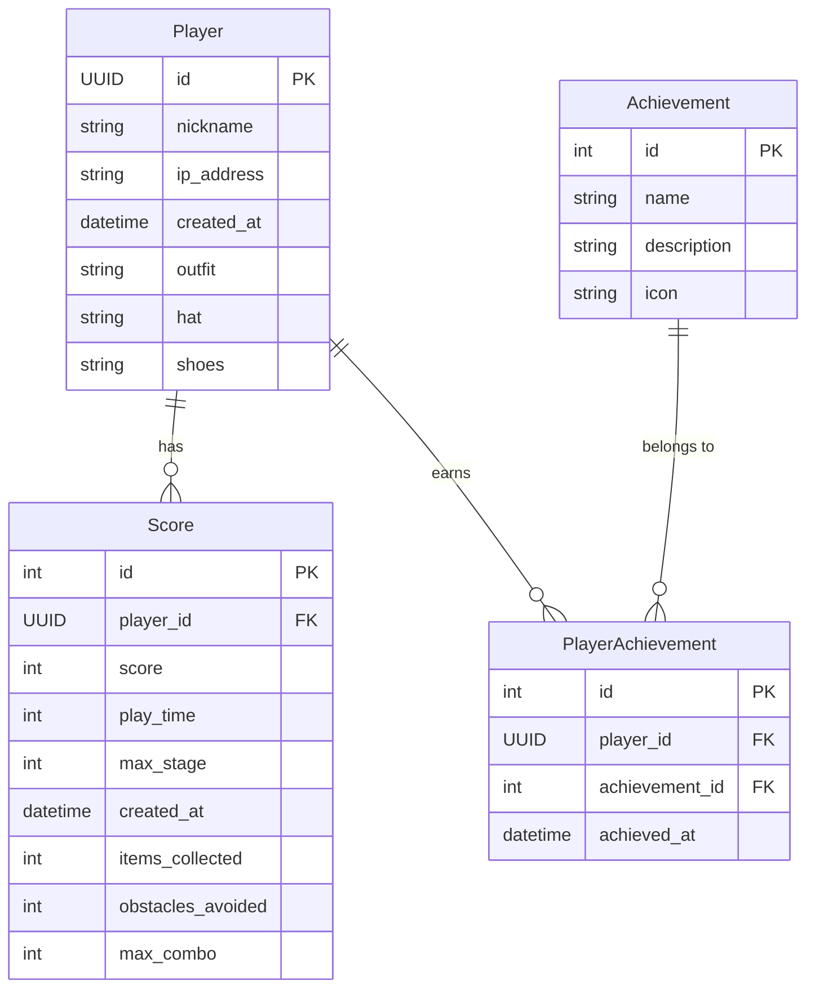

# Boo 게임 ERD (Entity Relationship Diagram)

버전: 1.3.0
최종 업데이트: 2025년 5월 11일

## 개체 관계도
[ERD란?](https://inpa.tistory.com/entry/DB-%F0%9F%93%9A-%EB%8D%B0%EC%9D%B4%ED%84%B0-%EB%AA%A8%EB%8D%B8%EB%A7%81-1N-%EA%B4%80%EA%B3%84-%F0%9F%93%88-ERD-%EB%8B%A4%EC%9D%B4%EC%96%B4%EA%B7%B8%EB%9E%A8)



## 모델 설명

### Player (플레이어)
- 게임을 플레이하는 사용자 정보를 저장
- UUID를 통해 고유 식별
- 커스터마이징 정보(의상, 모자, 신발) 보유

### Score (점수)
- 각 게임 플레이 결과를 저장
- 점수, 플레이 시간, 도달한 스테이지 등 기록
- 아이템 수집, 장애물 회피, 최대 콤보 등 게임 통계 포함
- 플레이어와 다대일(N:1) 관계

### Achievement (업적)
- 게임 내 달성 가능한 업적 정의
- 업적 이름, 설명 및 아이콘 정보 포함

### PlayerAchievement (플레이어 업적)
- 특정 플레이어가 달성한 업적 기록
- 플레이어와 업적 간 다대다(M:N) 관계를 구현하는 연결 테이블
- 업적 달성 시간 기록

## 관계 설명

1. **Player - Score (1:N)**
   - 한 플레이어는 여러 번 게임을 플레이하여 다수의 점수 기록을 가질 수 있음
   - 각 점수 기록은 오직 한 플레이어에게만 속함

2. **Player - PlayerAchievement - Achievement (M:N)**
   - 한 플레이어는 여러 업적을 달성할 수 있음
   - 하나의 업적은 여러 플레이어에 의해 달성될 수 있음
   - PlayerAchievement 테이블을 통해 이 다대다 관계 구현
   - 플레이어와 업적 조합은 유일함(unique_together 제약조건) 

## 실제 Django 모델 구현

```python
from django.db import models
import uuid

class Player(models.Model):
    id = models.UUIDField(primary_key=True, default=uuid.uuid4, editable=False)
    nickname = models.CharField(max_length=20, default="익명의 학생")
    ip_address = models.GenericIPAddressField()
    created_at = models.DateTimeField(auto_now_add=True)
    
    # 커스터마이징 정보
    outfit = models.CharField(max_length=50, default="default")
    hat = models.CharField(max_length=50, default="none")
    shoes = models.CharField(max_length=50, default="default")
    
    def __str__(self):
        return f"{self.nickname} ({self.id})"

class Score(models.Model):
    player = models.ForeignKey(Player, on_delete=models.CASCADE)
    score = models.IntegerField(default=0)
    play_time = models.IntegerField(default=0, help_text="플레이 시간(초)")
    max_stage = models.IntegerField(default=1, help_text="도달한 최대 스테이지")
    created_at = models.DateTimeField(auto_now_add=True)
    
    # 게임 통계
    items_collected = models.IntegerField(default=0)
    obstacles_avoided = models.IntegerField(default=0)
    max_combo = models.IntegerField(default=0)
    
    class Meta:
        ordering = ['-score']

    def __str__(self):
        return f"{self.player.nickname} - {self.score} 점 ({self.play_time}초)"

class Achievement(models.Model):
    """게임 업적 시스템"""
    name = models.CharField(max_length=50)
    description = models.TextField()
    icon = models.CharField(max_length=100, default="default")
    
    def __str__(self):
        return self.name

class PlayerAchievement(models.Model):
    """플레이어별 달성 업적"""
    player = models.ForeignKey(Player, on_delete=models.CASCADE)
    achievement = models.ForeignKey(Achievement, on_delete=models.CASCADE)
    achieved_at = models.DateTimeField(auto_now_add=True)
    
    class Meta:
        unique_together = ('player', 'achievement')
    
    def __str__(self):
        return f"{self.player.nickname} - {self.achievement.name}"
```

## 🎮 게임 기록 ERD 구조 해설 (입문자용)

우리 게임에서는 유저의 **플레이 기록**, **업적**, 그리고 유저가 **언제 어떤 업적을 달성했는지**를 기록하고 있어요.
이 정보를 **어떻게 연결해서** 저장할지를 보여주는 게 바로 **ERD (Entity-Relationship Diagram)** 라는 거예요.

쉽게 말해,

> **"무엇을 저장하고, 그것들이 어떻게 연결되어 있는지"를 나타낸 도식**

## 🧱 각 테이블 설명 (정보 묶음)

### 👤 Player (유저)

* 게임을 플레이하는 사람
* 필드: `닉네임`, `IP 주소`, `가입일시`, `착용한 옷/모자/신발` 등
* 각 유저는 고유한 ID(UUID)를 가집니다


### 📊 Score (게임 플레이 기록)

* 유저가 한 번 게임을 플레이할 때의 기록
* 필드: `점수`, `플레이 시간`, `최대 스테이지`, `아이템 수집`, `장애물 회피 수`, `콤보`, `기록된 시간`

### 🏆 Achievement (업적)

* 도전 과제: 예) "1000점 달성", "아이템 10개 수집"
* 필드: `업적 이름`, `설명`, `아이콘`
* **유저와 직접 연결되진 않음** — 대신 아래 PlayerAchievement 통해 연결돼요

### 🎖 PlayerAchievement (업적 달성 기록)

* 어떤 유저가 어떤 업적을 언제 달성했는지 저장
* Player와 Achievement 사이의 **중간 연결 테이블**
* 필드: `유저 ID`, `업적 ID`, `달성한 날짜`


## 🔗 테이블 간 관계 해설

### 1. `Player ||--o{ Score : "has"`

* **한 명의 유저는 여러 게임 기록을 가질 수 있다**
* 즉, 유저는 게임을 여러 번 할 수 있고, 각 게임 기록이 Score에 저장됨
* 예: "홍다오가 5월 1일, 2일, 3일에 각각 한 번씩 플레이함"


### 2. `Player ||--o{ PlayerAchievement : "earns"`

* **유저는 여러 개의 업적을 달성할 수 있다**
* 달성한 업적이 생길 때마다 PlayerAchievement에 기록
* 예: "홍다오가 '1000점 달성'과 '10개 아이템 수집' 업적을 얻음"


### 3. `Achievement ||--o{ PlayerAchievement : "belongs to"`

* **각 업적 달성 기록은 하나의 업적에 속한다**
* PlayerAchievement는 어떤 업적인지를 정확히 알아야 하니까
* 예: "이 기록은 '1000점 달성' 업적에 해당함"


## 📌 쉽게 비유하면?

| 구성 요소             | 비유                       |
| ----------------- | ------------------------ |
| Player            | 학생                       |
| Score             | 시험 결과                    |
| Achievement       | 상장                       |
| PlayerAchievement | 학생이 언제 어떤 상장을 받았는지 기록한 것 |


## 🧠 핵심 요약 정리

| 테이블 관계                          | 의미                    | 예시                  |
| ------------------------------- | --------------------- | ------------------- |
| Player → Score                  | 유저는 여러 게임 기록을 가짐      | 홍다오가 3번 플레이         |
| Player → PlayerAchievement      | 유저는 여러 업적을 달성함        | 홍다오가 3개 업적 땀        |
| PlayerAchievement → Achievement | 업적 달성 기록은 어떤 업적인지 연결됨 | 이 기록은 '1000점 달성' 업적 |


## 정규화 만족도 체크
[관련 자료](https://velog.io/@wisdom-one/%EC%A0%95%EA%B7%9C%ED%99%94Normalization)


| 정규화 단계 | 설명                    | 이 ERD는? |
| ------ | --------------------- | ------- |
| 1NF    | 모든 칸은 단일 값            | ✅ 만족    |
| 2NF    | 기본키의 일부에만 의존하는 컬럼 제거  | ✅ 만족    |
| 3NF    | 키가 아닌 다른 컬럼끼리 의존하지 않게 | ✅ 만족    |
